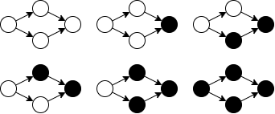

# 解けなかった理由

解けなかったり、解くのに時間がかかったりした理由について書き残す。

## 同じ選択をしたときは同じ状態に遷移しなければならない

部分和問題では各 $i$ について2つの状態に遷移するが、これは $x$ か $0$ のいずれかを選択しているからである。  

「 $x$ を選択したが、それは条件とは無関係であるため、選ばれたときと区別するために別の状態に遷移する」これは許されない。どちらも $x$ が選ばれた点で変わらないのだから同じ状態に遷移しなければならない。でないと、重複して数え上げてしまう恐れがある

## 包除原理の誤解

包除原理は、「1つ以上含む場合の数から、2つ以上含む場合の数を引き、3つ以上含む場合の数を足し、...」というものではなく、「1つだけに注目したときの場合の数から、2つだけに注目したときの場合の数を引き、3つだけに注目したときの場合の数を足し、...」というものである。  

ベン図でいえば、1つの円に含まれる要素の個数、2つの円に含まれる要素の個数、...を足し引きすれば、1つ以上の円に含まれる要素の個数が求められるということ。

## グラフ彩色の応用のような問題をDPで解こうとした

次のような問題をDPで解こうとした。

> 単純有向グラフが与えられる。各頂点を白か黒で塗る。始点が黒であるとき、終点も必ず黒で塗らなければならない。グラフの種類数を答えよ。

たとえば次のようなグラフでは6種類の塗り方が存在する。



このように、ある頂点の色が別の頂点の塗り方に影響を与えるとき、それをDPで解くことはおそらくできない。よって、何らかの言い換えをする必要がある。

## ABCのCやDで出題される実装重めの問題を雑に解きがち

良くない傾向。  
そもそも「実装重め」という認識が誤りの可能性がある。  
実装が重いと言われているABC343のE問題は、共通部分を構造体や関数という形で適切に切り出すと40行にも満たない。

<details>
<summary>40行にも満たないコード</summary>

```cpp
struct Cube {
  int a, b, c;
  Cube(int a, int b, int c) : a(a), b(b), c(c) {}
  int count(Cube x, Cube y) {
    int _a = max(0, (min({a, x.a, y.a}) + 7) - max({a, x.a, y.a}));
    int _b = max(0, (min({b, x.b, y.b}) + 7) - max({b, x.b, y.b}));
    int _c = max(0, (min({c, x.c, y.c}) + 7) - max({c, x.c, y.c}));
    return _a * _b * _c;
  }
  int count(Cube x) { return count(x, x); }
  void print() { cout << a << " " << b << " " << c << endl; }
};

void solve() {
  int V1, V2, V3;
  cin >> V1 >> V2 >> V3;
  vector<Cube> lst;
  repic(i, -7, 7) repic(j, -7, 7) repic(k, -7, 7) {
    lst.push_back(Cube(i, j, k));
  }
  for (auto c2 : lst) {
    for (auto c3 : lst) {
      Cube c1(0, 0, 0);
      int v3 = c1.count(c2, c3);
      int v2 = c1.count(c2) + c2.count(c3) + c3.count(c1) - v3 * 3;
      int v1 = 7 * 7 * 7 * 3 - v2 * 2 - v3 * 3;
      if (v1 == V1 && v2 == V2 && v3 == V3) {
        cout << "Yes" << endl;
        c1.print(), c2.print(), c3.print();
        return;
      }
    }
  }
  cout << "No" << endl;
}
```
</details>
